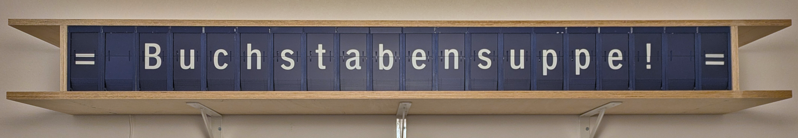

# Adtranz-Fallblattmodule

ESP32-Mikrocontrollercode und Leiterplattenlayouts für den Betrieb von 20 Adtranz-Fallblattmodulen mit Alphanumerischer Zeichenpalette.

## Funktionsweise

Wie in [diesem Mikrocontroller.net-Thread](https://www.mikrocontroller.net/topic/460531) auch gut mit Schaltplan erläutert, sind die Fallblattmodule mit einer absoluten Positionierung anhand einer 6-Bit-Gray-Codierungsscheibe versehen. 6 Infrarotdioden sind hinter einer auf der Hauptachse mitrotierenden Scheibe angebracht, deren ringförmige Aussparungen einen Gray-Code ergeben, der mit Infrarotsensoren auf der anderen Seite der Scheibe ausgelesen werden kann.

Meine Ansteuerung besteht aus einem Zentralmodul und einem Steckermodul für jedes einzelne Fallblattmodul. Das Steckermodul wird mit einen "Card-Edge-Connector" direkt an das Fallblattmodul angesteckt. Auf dem Steckermodul befindet sich lediglich ein Shift-Register und ein Komparatorchip. Der Motor wird, solange mit Betriebsspannung versorgt, solange weiterdrehen, bis der im Shift-Register eingestellte Code auf der Codierungsscheibe erreicht ist.

Auf dem Zentralmodul sitzt ein ESP32, der die als Daisy-Chain verbundenen Steckermodule bzw. deren Shift-Register als ein langes Shift-Register befüllt. Da die Steuerleitungen dieser Shift-Registerkette durchaus lang sind (ca. 2m) ist es erforderlich diese direkt am Ausgang des Mikrocontrollers seriell zu terminieren, da die saubere Signalübertragung durch Spiegelungseffekte andernfalls nicht mehr gewährleistet ist.

Außerdem war weitere Stabilisierung nötig bei den Schaltvorgängen des Motor-Relais im Fallblattmoduls. Direkt an den Motor wurde ein 100nF-Entstörkondensator 'angefrankensteint'. Außerdem ist ein 10 Ohm/2,2uF Snubberglied über den Relaiskontakt (zwischen 24 VAC N und 'b' auf der Platine des Fallblattmoduls gelegt) um für Ruhe beim Schalten zu sorgen. Ohne diese Maßnahmen hat die Abschaltung des Motors bei erreichen der gewünschten Stellung der Hauptachse nicht gut funktioniert.

## Leiterplattenlayouts

  

